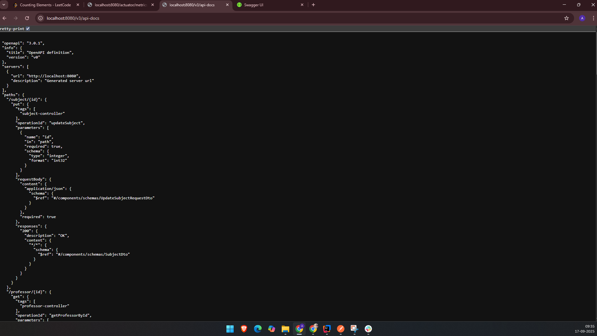
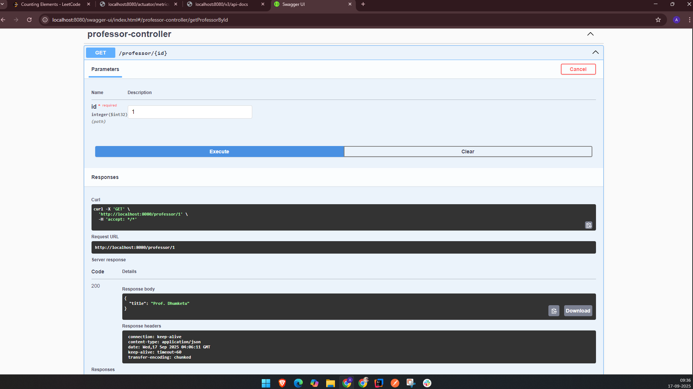
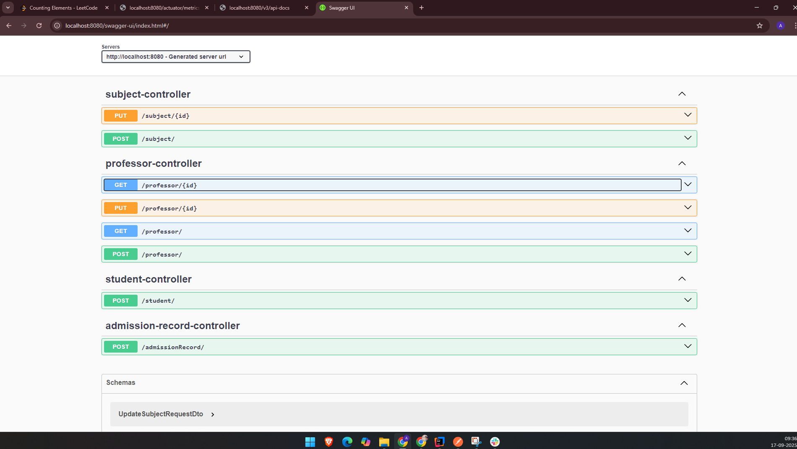
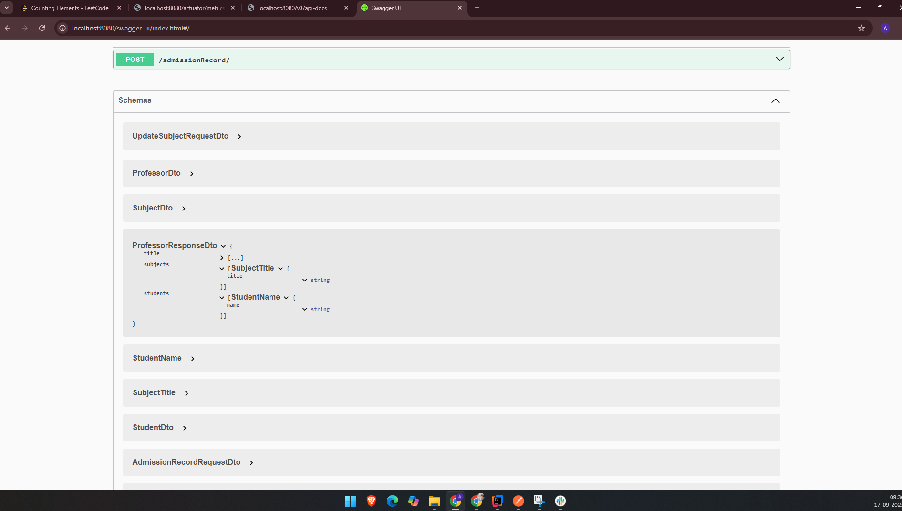

## OpenAPI with Swagger provides an excellent way to expose Endpoints of the Sprinboot Application
- Just add the "springdoc-openapi-starter-webmvcui" dependency in the pom.xml
- Go to the URL "/v3/api-docs" to view the APIs and info.

- Go to the URL "/swagger-ui.html" to use Swagger and test APIs.

