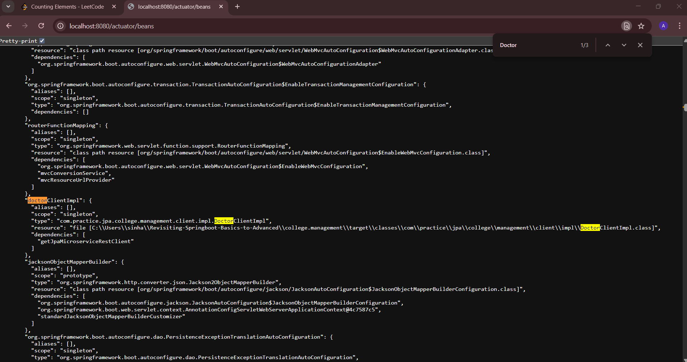
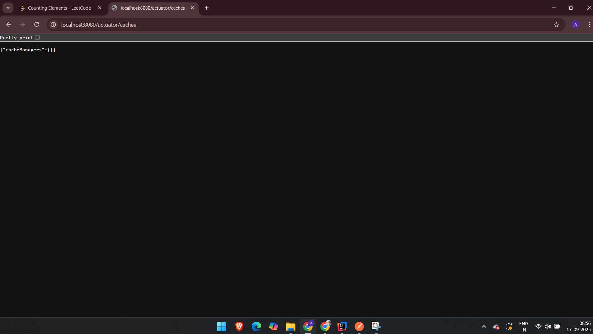
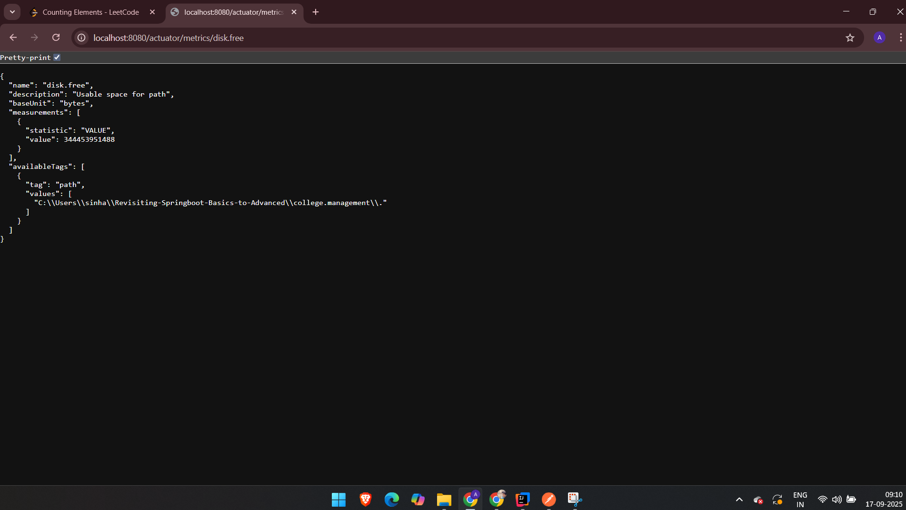

**Spring Boot Actuators**
- Add the dependency "spring-boot-starter-actuator" in the pom.xml it will provided endpoints that we can utilize to get insights for the microservices.
- Like the below endpoint in the screenshot below, I can see al the beans configured there dependencies and so on.
  
 

- Also you have a prebuilt health check endpoint.
   

- Check out for the caches.
 

- "/actuator" is the parent endpoint which gives lists of all the endpoint exposed and we can use form there as well.
![img_3.png](img_3.png

## Remember this /actuator is very very powerfull endppoint, you can use it's /actuator/metrics/{metric_name} to get info about a lot of stuff. Regarding the threads, the CRON jobs, the memory space that is free and a ton of stuff. 

- Refer for it's documentation and use it heavily in debugging and development.
