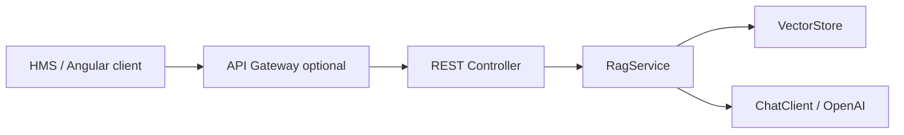

# Medical AI Suggestion Backend (RAG + Chat) — Implementation Plan

This document describes how we will add a **doctor-facing chatbot backend** to the existing `learn-springAI` module. It is a design and sequencing plan for your review. **No application code changes are assumed approved until you sign off on this document.**

---

## 1. Goals

- Provide a **REST API** that behaves like a **chatbot**: doctors send **symptoms and patient-reported context**; the service returns **structured, conversational suggestions** grounded in a **retrieval-augmented** knowledge layer (RAG).
- **Integrate with a hospital management system (HMS)** backend: the service is called from flows such as **Fast OPD** (`checkup-flow?type=fast-opd` style) where **Clinical Assistant** is a lightweight, always-available panel—doctors need **low-latency** replies and the platform must **scale horizontally** under bursty clinic load.
- Keep the product stance explicit: output is **decision support for licensed clinicians**, not a diagnosis, prescription, or patient-facing advice. Final clinical judgment remains with the doctor. (UI copy such as “diagnosis help” should be aligned with this in the product layer where possible.)
- Package the capability as a **deployable Spring Boot service** (one JAR today) that can later be extracted or replicated as a **standalone microservice** without redesign.

---

## 2. Integration context: HMS, Fast OPD, and Clinical Assistant UI

The following reflects the **Fast OPD** screen you shared: floating **Clinical Assistant** chat, text plus **voice** entry, and structured data on the same page.

### 2.1 Hospital management system

- The chat service sits **behind the hospital backend** (or API gateway): same trust zone, service-to-service auth (e.g. JWT or mTLS), correlation IDs for support and auditing.
- The HMS may supply **visit / session identifiers** and **structured chart data**; the RAG API should accept a **compact context bundle** so the model sees one-tap history and meds **without** the doctor retyping them.

### 2.2 Fast OPD workflow (high pace)

- Sessions are **short and frequent**; doctors expect **immediate feedback** comparable to typing a colleague. That drives **strict timeouts**, **small retrieval budgets**, and **streaming** where we want the first words on screen quickly (see §10 and §13).

### 2.3 Clinical Assistant client behavior

- **Voice:** Speech-to-text typically runs in the **browser or HMS client**; this backend receives **text only** in v1 (no audio pipeline in scope unless you add it later).
- **Unstructured input:** Doctor message (symptoms, patient quotes, “this sound” notes, etc.).
- **Structured context from the same screen (recommended request fields):**
  - Selected **history chips** (e.g. Diabetes, Hypertension, Thyroid, Asthma)—as a list of codes or display strings agreed with the HMS.
  - **Current medications** (names or formulary IDs) when the OPD view already lists them.
  - Optional: **flow type** (e.g. `fast-opd`) for analytics and prompt tuning.
- **Investigations (uploads):** PDF/image analysis is **out of scope for v1** unless the HMS extracts text elsewhere; the API can reserve an optional `attachmentsSummary` field for **pre-extracted** text supplied by another service.

### 2.4 Performance and scalability (non-functional)

| Concern | Direction |
|--------|-----------|
| **Latency** | Keep `topK` and **context character budget** tight; avoid extra hops inside the JVM; configure **HTTP client timeouts** and pool sizes for the LLM provider; consider **warm-up** on deploy. |
| **Perceived speed** | **Server-Sent Events (SSE) or chunked streaming** from the LLM so the UI can render tokens as they arrive—especially valuable for Fast OPD. |
| **Scale out** | **Stateless** app instances behind a load balancer; **shared** PostgreSQL/pgvector (or dedicated vector tier later); tune DB connection pools per instance. |
| **Resilience** | Timeouts + clear error JSON; optional **fallback** when vector search fails (LLM with “no retrieved protocol” mode). |
| **Caching** | **No default caching of request bodies** that may contain PHI. Any embedding/query cache must be policy-approved (e.g. hashed non-PHI keys only). |

### 2.5 CORS and environments

- **Dev:** allow Angular origin (e.g. `http://localhost:4200`) via configuration.
- **Prod:** restrict to known HMS / gateway origins; credentials policy aligned with how the gateway forwards tokens.

---

## 3. Current codebase (baseline)

| Piece | Location / behavior |
|--------|---------------------|
| Spring Boot | `3.5.11`, Java 17 |
| Spring AI | `1.1.2` BOM; `spring-ai-starter-model-openai`, `spring-ai-starter-vector-store-pgvector` |
| LLM access | `ChatClient` bean in `AIConfig`; `AIService` uses `PromptTemplate` + `chatClient` (e.g. `getAiMedicalSuggestions` — **plain LLM, no retrieval**) |
| Vectors | `VectorEmbedding`: `EmbeddingModel`, `VectorStore`, `similaritySearch` with `SearchRequest` (`topK`, `similarityThreshold`); sample **movie** documents in `ingestDataToVectorStore` |
| Database | PostgreSQL + pgvector via `application.properties`; `docker-compose.yml` for local Postgres on port **5435** |
| HTTP layer | **No** `@RestController` yet — API surface will be **new** |

This plan **reuses** `ChatClient`, `VectorStore`, `EmbeddingModel`, and the same configuration style. It **introduces** a dedicated RAG orchestration path and REST endpoints.

---

## 4. Proposed architecture

1. **Controller** — validates input, maps to DTOs, returns JSON **or** **SSE stream** for Fast OPD (see deliverables).
2. **RagService** — builds **retrieval query** from message + structured HMS context, runs **similarity search** on `VectorStore`, builds a **context block** from top-k `Document`s, then calls **`ChatClient`** with a **system prompt** that:
   - states the assistant is **supporting a physician**;
   - requires **citations / “per retrieved excerpt”** style when sources exist;
   - forbids definitive diagnosis and urges **differential thinking** and **“verify with guidelines / exam”** language.
3. **Knowledge ingestion** — separate from the chat path: load **chunked reference text** (e.g. hospital-owned protocols, curated summaries) into `Document`s with **metadata** (`source`, `topic`, `chunkId`, optional `lastReviewed`).

**Microservice framing (practical):**

- **Phase A (this module):** Single Spring Boot app with a clear **package boundary** e.g. `...rag`, `...web`, `...ingestion` so the RAG API can be split later.
- **Phase B (optional):** Same code in a repo that builds only this artifact; deploy behind API gateway; shared nothing except DB or a dedicated vector DB; **multiple replicas** for peak OPD hours.

---

## 5. API design (draft)

All paths under a version prefix, e.g. `/api/v1`.

| Method | Path | Purpose |
|--------|------|--------|
| `POST` | `/api/v1/clinical-chat/messages` | Send **turn**: doctor message + optional HMS structured context |
| `POST` | `/api/v1/clinical-chat/messages/stream` | **Same body**, **SSE** stream of assistant text (recommended for Fast OPD UX) |
| `POST` | `/api/v1/admin/knowledge/ingest` | **Optional**, secured: bulk or single-document ingest (may be disabled in prod or protected by role/API key) |
| `GET` | `/actuator/health` | Liveness (add `spring-boot-starter-actuator` if not present) |

**Request body (example, non-final names):**

- `message` (required): free text — symptoms, patient narrative, voice-derived text.
- `structuredHistory` (optional): list of selected conditions from one-tap chips (e.g. `["diabetes","hypertension"]`).
- `currentMedications` (optional): list of strings or codes from HMS.
- `flowType` (optional): e.g. `fast-opd` for routing/analytics.
- `visitCorrelationId` (optional): opaque ID from HMS for logs (avoid raw PHI in logs).
- `conversationId` (optional): UUID for multi-turn; **Phase 1** can echo and remain **stateless** for history.

**Response body (non-streaming):**

- `reply`: assistant text for the chat bubble.
- `retrievedSources`: list of `{ "source": "...", "excerpt": "..." }` derived from `Document` metadata + short snippet.
- `disclaimer`: short fixed string that this is **not** a substitute for clinical judgment.

---

## 6. RAG behavior (detailed)

1. **Query construction:** Combine `message` + `structuredHistory` + `currentMedications` (normalized to a single line each) into the **embedding search string** so retrieval matches **comorbidity-aware** protocol chunks where the knowledge base supports it.
2. **Retrieval:** Call `vectorStore.similaritySearch(SearchRequest...)` with configurable `topK` and `similarityThreshold` (externalize to `application.properties` to match `VectorEmbedding` style).
3. **Prompt assembly:**
   - **System:** role, safety boundaries, “supporting physician”, no patient-direct output, cite retrieved context.
   - **User:** clinical question + formatted **CONTEXT** section from retrieved docs (truncate per chunk to token-safe limits).
4. **No hits / low similarity:** Still call LLM with an explicit “no relevant internal sources retrieved” instruction so the model does **not** hallucinate institutional sources; optionally return a shorter reply suggesting broader differentials and literature review.

---

## 7. Refactors vs. new code (minimal churn)

- **Add** `RagService` (or `ClinicalRagService`) that composes `VectorStore`, `EmbeddingModel` (if needed beyond `VectorStore` internal embed), and `ChatClient`.
- **Keep** `AIService` for demos or legacy calls; **migrate** `getAiMedicalSuggestions` logic into shared prompt helpers **only if** you want one canonical prompt — otherwise leave as-is to reduce diff scope.
- **Evolve** `VectorEmbedding`: either rename responsibilities (ingest vs. search) or add a sibling `KnowledgeIngestionService` so movie samples can be replaced or gated by profile (`dev` vs `prod`).
- **Add** REST package: `controller` + `dto` + `exception` handler.

---

## 8. Configuration and secrets

- Move **API keys** out of committed `application.properties` into **environment variables** (e.g. `SPRING_AI_OPENAI_API_KEY`) — **strongly recommended** before any deployment; the repo currently contains a key that should be rotated.
- New properties (examples): `app.rag.top-k`, `app.rag.similarity-threshold`, `app.rag.max-context-chars`, `app.clinical-chat.llm-timeout`, `app.clinical-chat.stream-enabled`, optional `app.clinical-chat.allowed-origins` for CORS.

---

## 9. Security, compliance, and product notes

- **PHI:** Production Fast OPD traffic may include identifiable context. Deployment must meet **HIPAA** (or local equivalent): BAA with model provider if applicable, encryption in transit, access control, audit logs, retention policy, and **minimal logging** (no full message bodies in info-level logs unless approved).
- **AuthN/Z:** Integrate with **HMS identity**: JWT validation or internal service token; dev may use a static API key.
- **Disclaimer:** Every response should include or be paired with a **fixed disclaimer** in API contract and UI.

---

## 10. Dependencies (likely additions)

- `spring-boot-starter-actuator` — health for orchestrators / k8s.
- `spring-boot-starter-validation` — `@Valid` on request DTOs.

(No change to core Spring AI dependencies unless we add streaming adapters later.)

---

## 11. Testing strategy

- **Unit:** `RagService` with mocked `VectorStore` and `ChatClient` — assert prompt contains retrieved text when documents are returned.
- **Integration:** `@SpringBootTest` with testcontainers or embedded DB **if** we add H2/pgvector test profile; otherwise mock `VectorStore` at slice level.
- **Contract:** Example `curl`/HTTP file for the new endpoints; optional **load smoke** (e.g. many parallel `messages` calls) for regression on timeouts.

---

## 12. Deliverables after you approve this plan

1. DTOs + validation + global exception handler (consistent JSON errors).
2. `RagService` + REST controller for `POST .../clinical-chat/messages`.
3. **Streaming endpoint** (or single endpoint with `Accept: text/event-stream`) for **SSE**, aligned with Fast OPD **Clinical Assistant** UX.
4. Config properties (timeouts, RAG limits, CORS) + env-based secrets.
5. Optional: actuator + health; optional: secured ingest endpoint behind a property flag.
6. Replace or profile-gate demo movie ingestion so clinical chunks can be loaded for real RAG.

---

## 13. Open decisions (for you to confirm in review)

1. **Knowledge source:** What documents will we ingest first (file bundle, admin uploads, or SQL seed)?
2. **Multi-turn memory:** Stateless Phase 1 vs. server-side conversation store in Phase 2?
3. **Streaming:** **Strong default for Fast OPD** — confirm SSE in **v1** vs. JSON-only first.
4. **Auth:** HMS **JWT** validation rules (issuer, JWKS URL) vs. internal API key only.
5. **Correlation IDs:** Exact header names (`X-Visit-Id`, `X-Correlation-Id`) the gateway will send.

---

## 14. Explicit non-goals (v1)

- Patient-facing chat without physician in the loop.
- Automated diagnosis or treatment mandates.
- **Server-side** speech-to-text or **native** processing of uploaded imaging/PDF inside this service (HMS or another service may supply extracted text later).
- Replacing `docker-compose` production topology (only local dev is defined today).

---

When you are satisfied with this plan, reply with approval or edits to section 13 (and any other section). Implementation will follow **only after** that sign-off.
