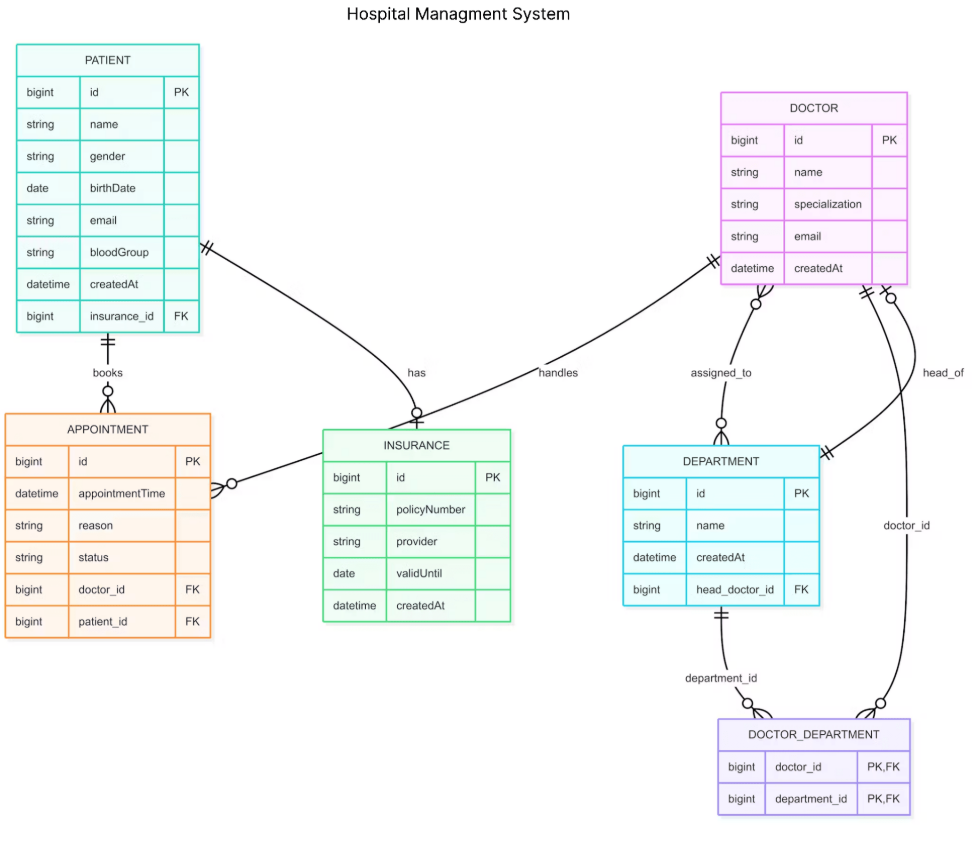

## ERD Understanding
** Just Two Rules to Remember ** 
--
## Rule 1:
Single line : One Mapping  
Multiple Lines : Many Mapping  
1. So say the connection line between two tables, one has single cut and other side has double cut, it means **One to Many** Mapping.
2. Say the connection line at both ends have double cuts, its **Many to Many** mapping.
3. Say the connection line at both ends have single cut only it means both of those tables share **One to One** mapping relationship. 

## Rule 2:
Single Cut : Participating partially in the relationship  
Circular End : Participating fully in the relationship

The table having Circular end in the connecting line means that particular table's objects cannot exist without the object of tables at the other end.  
So the end with circle can be understood as the one fully participating. And the one with single line as the one partially participating, as it can exist on it's own.
 
<h3>Explaining above rules with example</h3>

<h4>Patient to Appointment Relationship</h4>
1. One to Many (One Patient can have several Appointments, but vice-versa not true)
2. Appointment is fully participating and Patient is partially participating.

<h4>Doctor to Department Relationship</h4>
1. Many to Many 
2. Both Doctor and Department have full participation. Doctor cannot exist without Department and Department cannot exists without doctor.

**OWNING AND INVERSE SIDE**
-- 
Always remember that in a relational database if two tables have a relation then we should have one side as owning side and other side as inverse side.
--
The owning side is the one having the foreign key, like between Patient and Insurance relations, Patient is the owning side.  
Like we can put Foreign Key as Patient_ID in the Insurance table but then who to trust it for referencing the relation so we have FK on one side. 
Like in case of Appointment it has FK for both doctor and patient, that means it is the owning side for both reltion ships, <B>DOCTOR----APPOINTMENT</B> and <B>PATIENT----APPOINTMENT</B>. 
